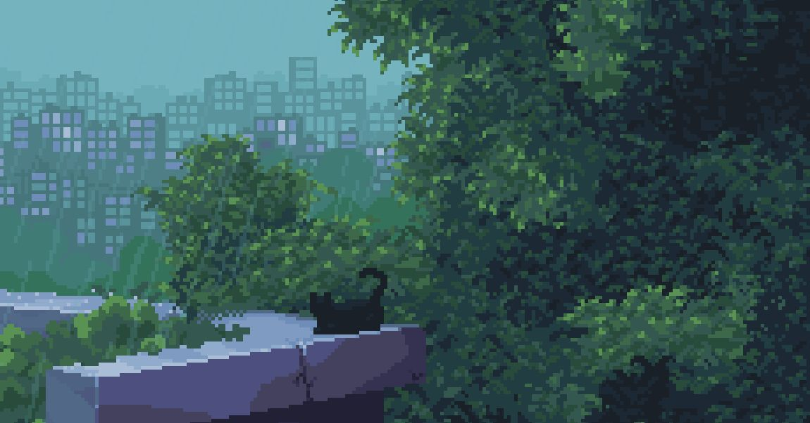
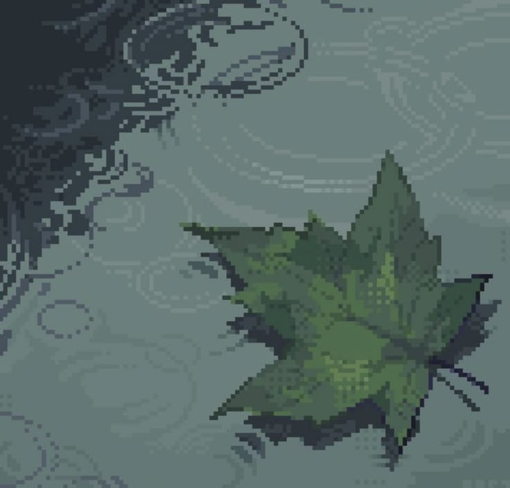

 

 

---

### `{ about_me }`

<table border="0" cellspacing="0" cellpadding="0">
<tr>
<td valign="top" width="68%">

**Heyy, I'm Priyanka Tiwari!!**

I roam the internet building whatever topic catches my eye or piques my interest. Well, I'm not that random as, this first sentence is making me sound like. Its like i work across a spectrum lying between hardware and software...yeah, that sounds about right :)

Right now I'm experimenting with *AI infra and ML systems*....quantization sensitivity, edge deployment, inference efficiency & ML observability....if any of these topics interest you then I would love to hear about it or your projects!!

</td>
<td valign="top" width="4%"></td>
<td valign="top" width="28%">

</td>
</tr>
</table>

 

---

### `{ top_projects }`

 

`Full lexer` · `Parser` · `AST` · `KiCad` · `Compiler` · `DSL`

 

`Binary ISA` · `Software rasterizer` · `R-2R DAC` · `VGA output` · `Dual-core FreeRTOS`

 

`Edge Deployment` · `INT8 inference on ESP32 S3 PIE` · `CNN`

 

---

### `{ stack }`

 

---

### `{ contributions }`

  

<picture>
  <source media="(prefers-color-scheme: dark)"  srcset="./assets/github-contribution-grid-snake-dark.svg"/>
  <source media="(prefers-color-scheme: light)" srcset="./assets/github-contribution-grid-snake.svg"/>
  
</picture>

  

 
